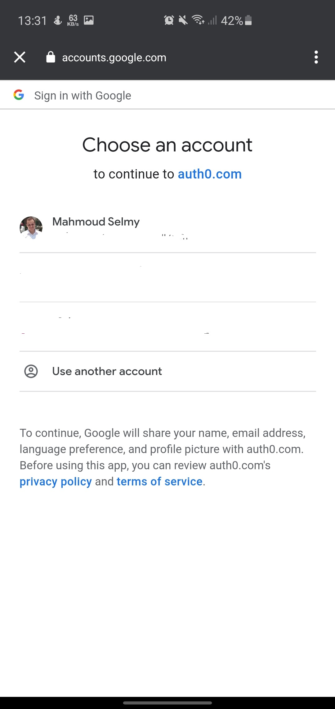
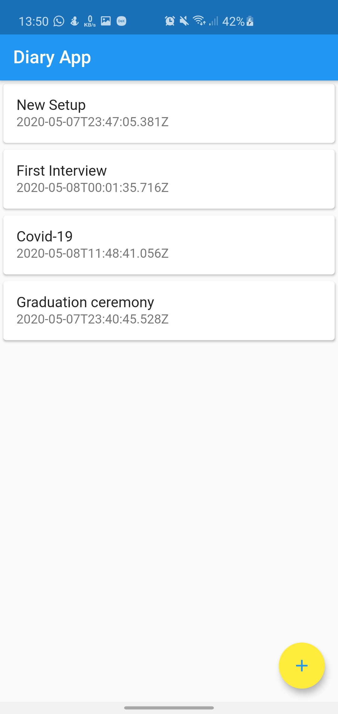

# Diary
This is part of my capstone project for udacity's cloud developer nano degree. 

This is the client application, you can check [AWS Serverless API](https://github.com/MahmoudSelmy/dairy-serverless-api) for more details about the backend.

It is a flutter application that allows users to document their experiences and memories.

# Use Cases

> ## 1) Login
> The diary app uses Auth0 to provide authentication for users.

| Login page  | Redirection to auth0 page |
| ------------- | ------------- |
|   |   |
| Auth0 page  | Sign in using gmail |
|   |   |

> ## 2) Browsing memories
> The diary app lists all the current user memories on the home page and allows users to check memory details by clicking on it.

| Home page  | New setup memory details |
| ------------- | ------------- |
|   |   |

> ## 3) Create new memory
> The diary app allows users to create new memory by clicking the add floating button on the home page.

| Home page  | New setup memory details | Write details and title | 
| ------------- | ------------- | ------------- |
|   |   |   |
| Select attached image | Home page |
|   |   |

> ## 4) Delete memory
> The diary app allows users to delete any memory by using the delete floating button on the memory details page.

| Home page  | Memory details page |
| ------------- | ------------- |
|   |   |
| Deletion in progress  | Home page |
|   |   |
